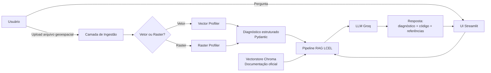

# GeoPython Assistant v2

**Assistente acadêmico de Geociências baseado em Retrieval-Augmented Generation (RAG) para diagnóstico de arquivos geoespaciais (vetoriais e matriciais) e geração de código Python contextualizado, com referências verificáveis à documentação oficial.**

---

## Resumo

O GeoPython Assistant v2 é uma evolução substancial da primeira versão deste projeto. Enquanto a versão original consistia em um assistente conversacional baseado exclusivamente em engenharia de prompt sobre um *Large Language Model* (LLM) hospedado na Groq, a presente versão incorpora uma arquitetura de Retrieval-Augmented Generation (RAG) dupla: (i) um pipeline de diagnóstico estruturado sobre arquivos geoespaciais fornecidos pelo usuário, e (ii) um pipeline de recuperação de trechos relevantes a partir da documentação oficial das principais bibliotecas Python do ecossistema geoespacial. Essa arquitetura visa mitigar limitações conhecidas de LLMs em domínios técnicos especializados, particularmente a alucinação de assinaturas de funções, parâmetros e padrões de uso, ao mesmo tempo em que oferece sugestões de código condicionadas às características reais do dado submetido.

O projeto é desenvolvido como contribuição ao portfólio público de ciência de dados aplicada à Engenharia Florestal, Geoprocessamento e Sensoriamento Remoto, com nível didático compatível com a literatura científica de pós-graduação.

## Motivação e contexto científico

Profissionais e estudantes de Geociências, Engenharia Florestal, Engenharia Agronômica e disciplinas correlatas frequentemente recorrem a assistentes baseados em LLMs para auxílio na escrita de código Python. Contudo, tais assistentes apresentam três limitações recorrentes quando operam sem ancoragem externa:

1. **Alucinação de API**: produção de chamadas a funções inexistentes ou com assinatura incorreta em bibliotecas de evolução rápida como `geopandas`, `rasterio` e `rioxarray`.
2. **Insensibilidade ao dado real**: sugestões genéricas que ignoram o sistema de referência de coordenadas (CRS), o esquema de atributos, a topologia das geometrias, o tipo de pixel ou a presença de valores nulos do arquivo concreto.
3. **Ausência de rastreabilidade**: ausência de referências verificáveis às fontes técnicas (documentação oficial, normas, literatura), o que compromete o uso em contextos acadêmicos.

A combinação de diagnóstico geoespacial estruturado com RAG sobre documentação oficial endereça simultaneamente essas três limitações.

## Objetivos

### Objetivo geral

Desenvolver uma aplicação Streamlit que receba arquivos geoespaciais vetoriais ou matriciais e produza, por meio de Retrieval-Augmented Generation, (a) um diagnóstico técnico do arquivo e (b) sugestões de código Python contextualizadas e referenciadas para manipulação, análise e visualização do dado.

### Objetivos específicos

- Implementar módulos de *profiling* geoespacial vetorial (GeoPandas/Fiona) e matricial (Rasterio/Rioxarray) com saída em formato estruturado validado por Pydantic.
- Construir um pipeline de indexação da documentação oficial das principais bibliotecas geoespaciais em Python sobre um banco vetorial persistente (Chroma).
- Compor uma cadeia LCEL (LangChain Expression Language) que combine diagnóstico, recuperação de documentação e geração de resposta.
- Disponibilizar uma interface Streamlit didática para usuários finais.
- Estabelecer um conjunto de testes automatizados que assegurem a estabilidade dos componentes de diagnóstico e do pipeline RAG.

## Arquitetura



O fluxo operacional é o seguinte: o usuário submete um arquivo geoespacial via interface Streamlit; a camada de ingestão identifica o tipo (vetorial ou matricial) e despacha para o *profiler* correspondente; o diagnóstico estruturado é formatado em uma representação textual técnica; a pergunta do usuário é encaminhada ao retriever, que consulta o banco vetorial com a documentação oficial previamente indexada; o LLM recebe os três blocos de contexto (diagnóstico, trechos da documentação, pergunta) por meio de um *prompt template* e produz a resposta final, contendo código executável e seção obrigatória de referências.

## Stack tecnológica

| Camada                | Bibliotecas principais                                                       |
|-----------------------|------------------------------------------------------------------------------|
| Geoespacial vetorial  | `geopandas`, `shapely`, `fiona`, `pyproj`                                    |
| Geoespacial matricial | `rasterio`, `rioxarray`, `xarray`, `numpy`                                   |
| Visualização          | `folium`, `streamlit-folium`, `matplotlib`                                   |
| RAG e LLM             | `langchain`, `langchain-community`, `langchain-groq`, `langchain-huggingface`|
| Embeddings            | `sentence-transformers`                                                      |
| Banco vetorial        | `chromadb`                                                                   |
| Aplicação             | `streamlit`                                                                  |
| Configuração          | `pydantic`, `pydantic-settings`, `python-dotenv`                             |
| Qualidade             | `pytest`, `pytest-cov`, `ruff`, `black`, `mypy`, `pre-commit`                |

A escolha do provedor Groq segue a continuidade com a v1 e justifica-se pela latência reduzida em modelos abertos hospedados (Llama 3.3, GPT-OSS). O modelo de embeddings padrão é `sentence-transformers/msmarco-bert-base-dot-v5`, em coerência com o exemplo de RAG empregado no laboratório de referência.

## Estrutura do repositório

```
geopython-assistant-v2/
├── data/            Dados em estágios brutos, intermediários, processados e amostras
├── docs/            Documentação técnica do projeto e bibliografia
├── notebooks/       Notebooks didáticos de prototipagem e avaliação
├── references/      Documentação externa baixada para indexação
├── reports/         Figuras e relatórios derivados
├── scripts/         Scripts utilitários de build e bootstrap
├── src/             Código-fonte da biblioteca geopyassistant
└── tests/           Testes unitários e de integração
```

A organização segue a convenção *Cookiecutter Data Science*, adaptada para acomodar componentes específicos de aplicação (Streamlit) e indexação de documentação externa.

## Pré-requisitos

- Python 3.11 ou superior
- Sistema operacional Linux, macOS ou Windows 10/11
- Espaço em disco mínimo de 2 GB (modelo de embeddings, vetorstore e amostras)
- Conta na Groq Cloud para obtenção de chave de API gratuita em `https://console.groq.com/keys`
- Dependências geoespaciais nativas: `GDAL`, `GEOS`, `PROJ`. No Linux Debian/Ubuntu, instale com:

```bash
sudo apt-get update && sudo apt-get install -y gdal-bin libgdal-dev libgeos-dev libproj-dev
```

No Windows, recomenda-se utilizar o Anaconda/Miniconda com o canal `conda-forge` para resolver as dependências nativas automaticamente.

## Instalação reprodutível

Há dois caminhos suportados para a instalação. Recomenda-se o segundo (`uv`) por sua reprodutibilidade superior, mas o primeiro (`venv` + `pip`) é mantido por familiaridade.

### Caminho A: ambiente virtual padrão

```bash
git clone https://github.com/PedroLuizskt/GeoPython-Assistant-v2.git
cd GeoPython-Assistant-v2

python -m venv .venv
source .venv/bin/activate          # Linux/macOS
# .venv\Scripts\activate            # Windows PowerShell

pip install --upgrade pip
pip install -e ".[dev]"
```

### Caminho B: gerenciador `uv`

```bash
git clone https://github.com/PedroLuizskt/GeoPython-Assistant-v2.git
cd GeoPython-Assistant-v2

uv venv
source .venv/bin/activate
uv pip install -e ".[dev]"
```

Em seguida, copie o arquivo de variáveis de ambiente e preencha a chave da Groq:

```bash
cp .env.example .env
# Edite .env e defina GROQ_API_KEY
```

## Indexação da documentação oficial

O vetorstore com a documentação oficial das bibliotecas geoespaciais é construído offline, uma única vez, com o script dedicado:

```bash
python scripts/build_docs_index.py
```

A primeira execução baixa o modelo de embeddings (aproximadamente 400 MB) e persiste o índice em `data/processed/chroma_docs/`. As execuções subsequentes da aplicação reutilizam esse índice.

## Execução

```bash
streamlit run src/geopyassistant/ui/app.py
```

A aplicação será exposta em `http://localhost:8501`. Na interface, o fluxo é o seguinte:

1. Insira sua chave Groq na barra lateral (ou defina via `.env`).
2. Faça o upload de um arquivo vetorial (`.shp`, `.geojson`, `.gpkg`) ou matricial (`.tif`, `.tiff`, `.nc`).
3. Inspecione o painel de diagnóstico gerado automaticamente.
4. Formule sua pergunta no campo de chat.
5. A resposta apresenta diagnóstico contextual, código Python sugerido e a seção de referências à documentação oficial.

## Testes

A suíte de testes utiliza `pytest` com fixtures geoespaciais minúsculos versionados em `tests/data/`. Para executar:

```bash
pytest -v --cov=src/geopyassistant --cov-report=term-missing
```

Os testes estão organizados em:

- `tests/unit/`: testes unitários dos *profilers* e dos modelos Pydantic.
- `tests/integration/`: testes do pipeline RAG completo, com vetorstore em memória.

## Limitações conhecidas

- O diagnóstico de arquivos matriciais muito grandes (acima de 5 GB) está fora do escopo da versão atual e exigirá integração futura com Dask e leitura preguiçosa via Xarray.
- A cobertura da documentação indexada limita-se às bibliotecas listadas na stack tecnológica; APIs em nuvem (GEE, Planetary Computer) terão suporte parcial.
- O sistema não substitui a verificação humana de cláusulas legais ou decisões técnicas críticas.

## Roadmap

- v2.0: diagnóstico vetorial e matricial, RAG sobre documentação, interface Streamlit.
- v2.1: avaliação automatizada de respostas com *LLM-as-a-judge* sobre um conjunto-padrão de perguntas.
- v2.2: suporte a Dask e leitura preguiçosa para arquivos matriciais de grande porte.
- v2.3: integração com Google Earth Engine e Microsoft Planetary Computer.
- v3.0: empacotamento como serviço (FastAPI) com observabilidade Grafana/Prometheus.

## Como citar

Caso este trabalho seja utilizado em produção acadêmica, sugere-se a citação no formato:

> Vaz de Melo, P. L. R. (2026). *GeoPython Assistant v2: Retrieval-Augmented Generation aplicada ao diagnóstico de arquivos geoespaciais e geração de código Python*. Repositório de código. Disponível em: https://github.com/PedroLuizskt/GeoPython-Assistant-v2

O arquivo `CITATION.cff` no diretório raiz fornece os metadados em formato padronizado.

## Referências

A bibliografia completa em formato BibTeX encontra-se em `docs/references.bib`. As principais obras de apoio incluem:

- Rey, S. J.; Arribas-Bel, D.; Wolf, L. J. *Geographic Data Science with Python*. CRC Press, 2023.
- Lewis, P. et al. *Retrieval-Augmented Generation for Knowledge-Intensive NLP Tasks*. NeurIPS, 2020.
- Documentação oficial: GeoPandas (`https://geopandas.org`), Rasterio (`https://rasterio.readthedocs.io`), Rioxarray (`https://corteva.github.io/rioxarray`), Xarray (`https://docs.xarray.dev`), LangChain (`https://python.langchain.com`).

## Autor

**Pedro Luiz R. Vaz de Melo** — Engenheiro Florestal e Cientista de Dados Geoespacial.
GitHub: [@PedroLuizskt](https://github.com/PedroLuizskt)

## Licença

Este projeto é distribuído sob a Licença MIT. Consulte o arquivo `LICENSE` para os termos completos.
